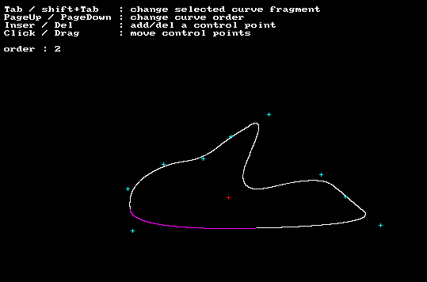

# minispline

Author: Sebastien Alaiwan

A tiny standalone spline computing function,
and a SDL demo app to test it.

<p align="center"></p>

To run the demo, simply launch:
```
./run.sh
```

You can also compile it yourself, using the following command:
```
g++ minispline.cpp `pkg-config sdl SDL_gfx --cflags --libs` -o minispline
```

